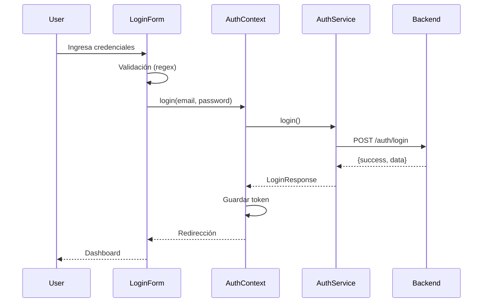

# Frontend - Sistema de Turnos

## 🎯 Overview

Frontend implementado con React + TypeScript + Vite + Tailwind CSS, siguiendo una arquitectura limpia y modular.

## 🏗️ Arquitectura

### Estructura de Carpetas
```
src/
├── api/                    # Configuración de API
│   └── axiosInstance.ts   # Instancia de Axios con interceptors
├── components/            # Componentes reutilizables
│   ├── forms/            # Formularios
│   │   └── LoginForm.tsx
│   ├── ui/               # Componentes UI base
│   │   ├── Button.tsx
│   │   ├── Input.tsx
│   │   └── ErrorMessage.tsx
│   └── PrivateRoute.tsx  # Rutas protegidas
├── context/              # Contextos de React
│   ├── AppContext.tsx
│   └── AuthContext.tsx
├── pages/                # Páginas principales
│   ├── LoginPage.tsx
│   └── WelcomePage.tsx
├── services/             # Lógica de API
│   └── authService.ts
└── assets/               # Recursos estáticos
```

## 🔐 Sistema de Autenticación

### Formato de Login
```
username@dominioempresa.com
```

**Ejemplo:** `test_admin@testempresa.com`

### Flujo de Autenticación

1. **Usuario ingresa credenciales** en formato `username@domain.com`
2. **Validación frontend** con regex personalizada
3. **Llamada a API** `/auth/login` del backend
4. **Procesamiento de respuesta** con estructura `{success: true, data: {...}}`
5. **Almacenamiento** de token y datos de usuario en contexto
6. **Redirección** a dashboard protegido

### Componentes Clave

#### LoginForm.tsx
- **Validación:** React Hook Form + Zod
- **Formato:** Regex para `username@domain.com`
- **UI:** Tailwind CSS con estados de carga
- **Errores:** Manejo centralizado de errores

#### AuthContext.tsx
- **Estado:** Usuario autenticado, loading, errores
- **Acciones:** Login, logout, verificación de token
- **Persistencia:** Token en localStorage
- **Interceptors:** Integración con Axios

#### authService.ts
- **API:** Comunicación con backend
- **Respuesta:** Manejo de estructura `{success, data}`
- **Errores:** Propagación de errores del backend
- **TODO:** Refresh token y logout pendientes

## 🚀 Endpoints Integration

### POST /auth/login
```typescript
// Request
{
  "email": "test_admin@testempresa.com",
  "password": "admin123"
}

// Response
{
  "success": true,
  "data": {
    "accessToken": "eyJhbGciOiJIUzI1NiIs...",
    "user": {
      "id": "usr_1771106679729_d1q8hu8c9",
      "email": "admin2@mail.com",
      "roles": ["admin"],
      "tenant": "testempresa.com"
    }
  }
}
```

## 🔧 Configuración

### Variables de Entorno
```env
VITE_API_URL=http://localhost:4000
```

### Dependencias Principales
```json
{
  "react": "^18.2.0",
  "react-dom": "^18.2.0",
  "react-router-dom": "^6.8.0",
  "axios": "^1.3.4",
  "react-hook-form": "^7.43.5",
  "@hookform/resolvers": "^2.9.11",
  "zod": "^3.20.6",
  "tailwindcss": "^3.2.7"
}
```

### Dependencias de Desarrollo
```json
{
  "@types/react": "^18.0.28",
  "@types/react-dom": "^18.0.11",
  "@vitejs/plugin-react": "^3.1.0",
  "typescript": "^4.9.3",
  "vite": "^4.1.0",
  "eslint": "^8.36.0",
  "@typescript-eslint/eslint-plugin": "^5.55.0"
}
```

## 🎨 UI/UX

### Diseño
- **Framework:** Tailwind CSS
- **Paleta:** Azul e índigo gradientes
- **Tipografía:** System fonts
- **Componentes:** Reutilizables y consistentes

### Estados
- **Loading:** Indicadores visuales durante peticiones
- **Errores:** Mensajes claros y contextualizados
- **Éxito:** Feedback visual de acciones exitosas
- **Validación:** En tiempo real con mensajes específicos

## 🧪 Testing

### Casos de Prueba Manuales

**✅ Login Exitoso:**
1. Navegar a `http://localhost:5173/login`
2. Ingresar `test_admin@testempresa.com`
3. Ingresar `admin123`
4. Click en "Iniciar Sesión"
5. Redirección a dashboard

**❌ Formato Inválido:**
1. Ingresar `email@invalido`
2. Mostrar error: "Formato inválido. Use: usuario@empresa.com"

**❌ Credenciales Inválidas:**
1. Ingresar `usuario@dominio.com`
2. Ingresar `password_wrong`
3. Mostrar error del backend

## 🔄 Flujo de Datos



## 📋 Características Implementadas

### ✅ Completas
- [x] Formulario de login con validación
- [x] Formato `username@domain.com`
- [x] Integración con backend API
- [x] Contexto de autenticación
- [x] Rutas protegidas
- [x] Manejo de errores
- [x] Estados de carga
- [x] Diseño responsive

### 🔄 En Progreso
- [ ] Refresh token implementation
- [ ] Logout endpoint
- [ ] Dashboard principal
- [ ] Perfil de usuario
- [ ] Gestión de turnos

### ⏳ Planeadas
- [ ] Registro de usuarios
- [ ] Recuperación de contraseña
- [ ] Configuración de perfil
- [ ] Notificaciones en tiempo real
- [ ] Reportes y estadísticas

## 🚨 Consideraciones Importantes

### Seguridad
- **Token storage:** LocalStorage (considerar HttpOnly cookies)
- **HTTPS:** Requerido para producción
- **CORS:** Configurado para `http://localhost:5173`
- **Sanitización:** Validación estricta de inputs

### Performance
- **Bundle size:** Optimizado con Vite
- **Lazy loading:** Implementado en rutas
- **Caching:** Configurado en Axios
- **Debouncing:** Considerar para inputs

### UX
- **Loading states:** Consistentes en toda la app
- **Error boundaries:** Manejo centralizado
- **Accessibility:** Atributos ARIA pendientes
- **Mobile first:** Diseño responsive

## 🔮 Próximos Pasos

### Inmediatos
1. **Implementar dashboard** principal
2. **Agregar refresh token** en backend
3. **Crear logout endpoint**
4. **Mejorar accesibilidad**

### Mediano Plazo
1. **Sistema de turnos** completo
2. **Panel de administración**
3. **Reportes y analytics**
4. **Notificaciones push**

### Largo Plazo
1. **App móvil** (React Native)
2. **Integración pagos**
3. **API pública**
4. **Multi-tenant avanzado**

---

**Frontend funcional y listo para desarrollo continuo.**
