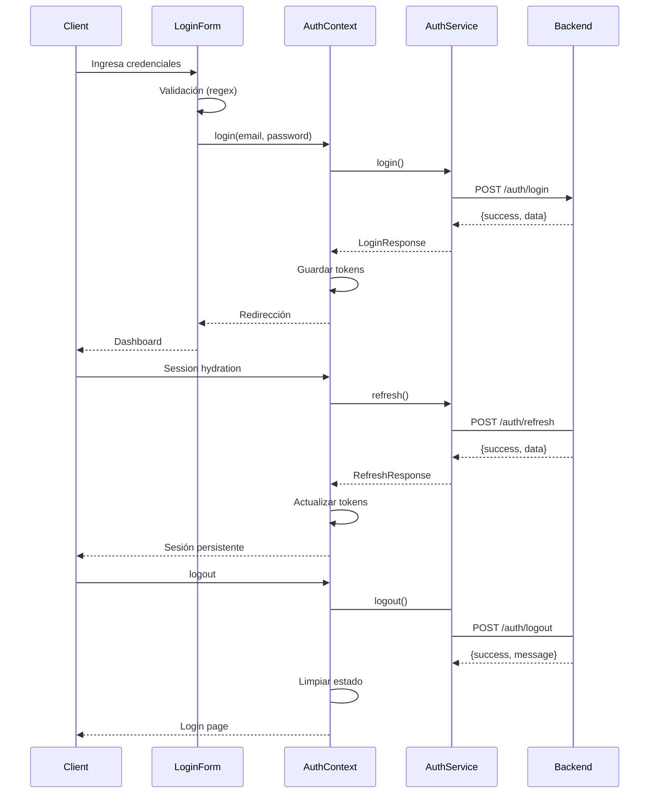

# Frontend - Sistema de Autenticación

## 🎯 Overview

Frontend implementado con React + TypeScript + Vite + Tailwind CSS, siguiendo una arquitectura limpia y modular con sistema de autenticación enterprise-ready con refresh tokens.

## 🔐 Sistema de Autenticación

### Formato de Login
```
username@dominioempresa.com
```

**Ejemplo:** `test_admin@testempresa.com`

### Flujo de Autenticación Completo

1. **Parseo de credenciales:** Extrae username y dominio del email
2. **Validación frontend** con regex personalizada
3. **Llamada a API:** `POST /auth/login` del backend
4. **Procesamiento de respuesta:** Estructura `{success: true, data: {...}}`
5. **Almacenamiento:** Access token + Refresh token en estado y HttpOnly cookie
6. **Redirección:** a dashboard protegido

### Refresh Token Flow

1. **Session Hydration:** Al montar la app, intenta `POST /auth/refresh`
2. **Request:** Envía refresh token (cookie o body)
3. **Validación:** Verifica token no expirado ni revocado
4. **Rotación:** Genera nuevo refresh token, revoca anterior
5. **Generación:** Nuevo access token con user info del refresh token
6. **Response:** Nuevo access token + refresh token en cookie

### Logout Flow

1. **Request:** Cliente envía refresh token
2. **Revocación:** Marca refresh token como revocado
3. **Cleanup:** Limpia HttpOnly cookie
4. **Response:** Confirmación de logout

## 🏗️ Arquitectura

### Estructura de Carpetas
```
src/
├── api/                    # Configuración de API
│   └── axiosInstance.ts   # Instancia de Axios con interceptors
├── components/            # Componentes reutilizables
│   ├── forms/            # Formularios
│   │   └── LoginForm.tsx
│   ├── ui/               # Componentes UI base
│   │   ├── Button.tsx
│   ├── Input.tsx
│   │   └── ErrorMessage.tsx
│   └── PrivateRoute.tsx  # Rutas protegidas
├── context/              # Contextos de React
│   ├── AppContext.tsx
│   └── AuthContext.tsx
├── pages/                # Páginas principales
│   ├── LoginPage.tsx
│   └── WelcomePage.tsx
├── services/             # Lógica de API
│   └── authService.ts
└── assets/               # Recursos estáticos
```

## 🔐 Sistema de Autenticación

### LoginResponse Interface
```typescript
export interface LoginResponse {
  accessToken: string;
  refreshToken: string;
  expiresIn: number;
  user: {
    id: string;
    email: string;
    roles: string[];
    tenant: string;
  };
}
```

### Componentes Clave

#### LoginForm.tsx
- **Validación:** React Hook Form + Zod
- **Formato:** Regex para `username@domain.com`
- **UI:** Tailwind CSS con estados de carga
- **Errores:** Manejo centralizado de errores

#### AuthContext.tsx
- **Estado:** Usuario autenticado, loading, errores
- **Acciones:** Login, refresh, logout, verificación de token
- **Persistencia:** Access token y refresh token en estado
- **Interceptors:** Integración con Axios
- **Session Hydration:** Automático al montar la aplicación

#### authService.ts
- **API:** Comunicación con backend
- **Respuesta:** Manejo de estructura `{success, data}`
- **Refresh:** Implementado con rotación automático
- **Logout:** Implementado con revocación completa
- **Errores:** Propagación de errores del backend

## 🚀 Endpoints Integration

### POST /auth/login

**Request:**
```json
{
  "email": "test_admin@testempresa.com",
  "password": "admin123"
}
```

**Response Exitoso (200):**
```json
{
  "success": true,
  "data": {
    "accessToken": "eyJhbGciOiJIUzI1NiIsInR5cCI6IkpXVCJ9...",
    "refreshToken": "8e5a140f1460f11b81a96ad569971bc1c7be52fe...",
    "expiresIn": 900,
    "user": {
      "id": "usr_1771106679729_d1q8hu8c9",
      "email": "admin2@mail.com",
      "roles": ["admin"],
      "tenant": "testempresa.com"
    }
  }
}
```

**Headers:**
```
Set-Cookie: refreshToken=8e5a140f1460f11b81a96ad569971bc1c7be52fe...; HttpOnly; Secure; SameSite=Strict; Path=/; Max-Age=604800000
```

### POST /auth/refresh

**Request:**
```json
{
  "refreshToken": "8e5a140f1460f11b81a96ad569971bc1c7be52fe..."
}
```

**Response Exitoso (200):**
```json
{
  "success": true,
  "data": {
    "accessToken": "eyJhbGciOiJIUzI1NiIsInR5cCI6IkpXVCJ9...",
    "refreshToken": "91a0d65112f2a069e1d390e9c7417e53b227d9e4...",
    "expiresIn": 900,
    "user": {
      "id": "usr_1771106679729_d1q8hu8c9",
      "email": "admin2@mail.com",
      "roles": ["admin"],
      "tenant": "testempresa.com"
    }
  }
}
```

### POST /auth/logout

**Request:**
```json
{
  "refreshToken": "8e5a140f1460f11b81a96ad569971bc1c7be52fe..."
}
```

**Response Exitoso (200):**
```json
{
  "success": true,
  "message": "Sesión cerrada exitosamente"
}
```

**Headers:**
```
Set-Cookie: refreshToken=; HttpOnly; Secure; SameSite=Strict; Path=/; Expires=Thu, 01 Jan 1970 00:00:00 GMT
```

## 🔧 Configuración

### Variables de Entorno
```env
VITE_API_URL=http://localhost:4000
```

### Dependencias
```json
{
  "react": "^18.2.0",
  "react-dom": "^18.2.0",
  "react-router-dom": "^6.8.0",
  "axios": "^1.3.4",
  "react-hook-form": "^7.43.5",
  "@hookform/resolvers": "^2.9.11",
  "zod": "^3.20.6",
  "tailwindcss": "^3.2.7"
}
```

## 🧪 Testing

### Casos de Prueba

**✅ Login Exitoso:**
```bash
curl -X POST http://127.0.0.1:4000/auth/login \
  -H "Content-Type: application/json" \
  -d '{ "email": "test_admin@testempresa.com", "password": "admin123" }' \
  -c cookies.txt
```

**✅ Refresh Token Exitoso:**
```bash
curl -X POST http://127.0.0.1:4000/auth/refresh \
  -H "Content-Type: application/json" \
  -d '{ "refreshToken": "8e5a140f1460f11b81a96ad569971bc1c7be52fe..." }' \
  -b cookies.txt
```

**✅ Logout Exitoso:**
```bash
curl -X POST http://127.0.0.1:4000/auth/logout \
  -H "Content-Type: application/json" \
  -d '{ "refreshToken": "8e5a140f1460f11b81a96ad569971bc1c7be52fe..." }' \
  -b cookies.txt
```

**❌ Credenciales Inválidas:**
```bash
curl -X POST http://127.0.0.1:4000/auth/login \
  -H "Content-Type: application/json" \
  -d '{ "email": "usuario@dominio.com", "password": "wrong" }'
```

**❌ Refresh Token Inválido:**
```bash
curl -X POST http://127.0.0.1:4000/auth/refresh \
  -H "Content-Type: application/json" \
  -d '{ "refreshToken": "token_invalido" }'
```

## 🔒 Seguridad

### Token Configuration
- **Access Token:** HS256, 15 minutos
- **Refresh Token:** SHA-256 hash, 7 días
- **Token Rotation:** Nuevo refresh token cada uso
- **HttpOnly Cookies:** Protección contra XSS
- **SameSite Strict:** Protección CSRF

### Seguridad de Refresh Tokens
- **Hashing:** SHA-256 del token original
- **Rotation:** Nuevo token generado cada refresh
- **Revocación:** Tokens marcados como inactivos
- **Cleanup:** Limpieza automático de tokens expirados
- **User Info:** Información del usuario almacenada en BD

### Validaciones
- **Formato email:** username@domain.com
- **Usuario activo:** Verificación campo `activo`
- **Empresa activa:** Verificación campo `empresa_activa`
- **Password:** Comparación segura con bcrypt
- **Token Expiración:** Verificación de fechas
- **Token Revocación:** Verificación de estado activo

## 🔄 Flujo Completo



## 📋 Características Implementadas

### ✅ Completas
- [x] Login con formato username@domain.com
- [x] Access token con 15min de expiración
- [x] Refresh token con 7 días de vida
- [x] Token rotation automático
- [x] HttpOnly cookies para refresh tokens
- [x] Logout con revocación completa
- [x] Session hydration automática
- [x] Multi-sesión soportada
- [x] Validaciones de usuario y empresa activa
- [x] Seguridad enterprise-grade (XSS, CSRF protection)

### 🔧 Middleware de Autorización
- [ ] JWT verification middleware
- [ ] Role-based access control (RBAC)
- [ ] Tenant isolation
- [ ] Protected routes

## 🚨 Errores Comunes

### Network Error
- **Causa:** Frontend no puede conectar a backend
- **Solución:** Verificar que backend esté corriendo en `http://localhost:4000`

### Refresh Token Inválido
- **Causa:** Token no encontrado, expirado o revocado
- **Solución:** Realizar nuevo login

### Usuario Inactivo
- **Causa:** Campo `activo` = false
- **Solución:** Activar usuario desde administración

### Empresa Inactiva
- **Causa:** Campo `activo` = false en tabla empresas
- **Solución:** Activar empresa desde administración

### Formato Inválido
- **Causa:** Email no contiene @ o formato incorrecto
- **Solución:** Usar formato username@dominio.com

### Token Rotation Error
- **Causa:** Error en generación de nuevo refresh token
- **Solución:** Verificar configuración de crypto service

---

**Frontend con sistema de autenticación enterprise-ready con refresh tokens implementado y listo para producción.**
